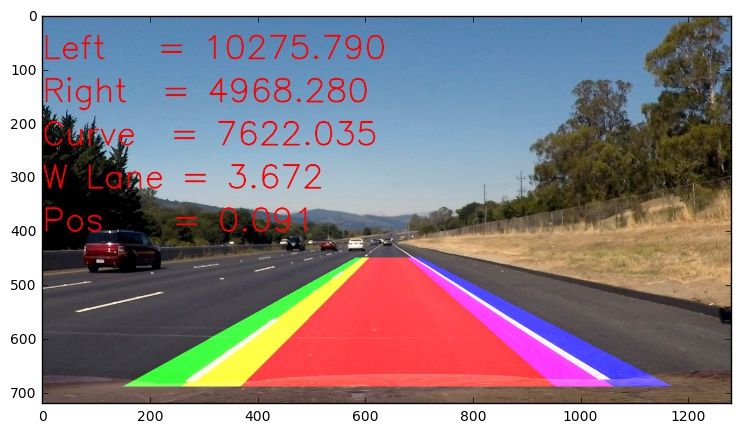

# Advanced Lane Finding Project

## *Abstract*

The goals/steps of this project are the following:

* Compute the camera calibration matrix and distortion coefficients given a set of chessboard images.
* Apply a distortion correction to raw images.
* Create a thresholded binary image.
* Apply a perspective transform to rectify binary image ("birds-eye view").
* Detect lane pixels and fit to find the lane boundary.
* Determine the curvature of the lane and vehicle position with respect to the center.
* Warp the detected lane boundaries back onto the original image.
* Display of the lane boundaries and numerical estimation of lane curvature and vehicle position.

An image processing pipeline was built that allows to detect road marking lines. It was tested on sample images and the videos. This pipeline can successfully identify the road marking under simple conditions which is represented by the project video and sample images. This pipeline cannot identify lines in complex conditions which are represented by challenge video.  

## Files submitted
The code is accesible on [github link](https://github.com/YuryBrodskiy/carnd-yury.git)

* Advanced-Lane-Finding.ipynb contains the code of the pipeline and related tests
* report.md summary the results
* output\_images processed sample images and images used in this report
* output\_videos processed sample videos

## Algorithm: Pipeline

### Architecture
The algorithm is an image processing pipeline. The following sequence of transformations are employed:
 
 + Remove lens-induced distortions
 + Apply a Perspective transform to obtain a top view on the road
 + If not present, generate a new mask to remove outliers  -- "heat map."
 + Use color filters with thresholds to identify the road markings
 + Use the "heat map" to remove outliers and separate left and right lines
 + Fit a second order polynomial over pixels that has been identified as the road markings
 + Generate heat map for next frame using the fitted polynomial
 + Back project resulting polynomial to the road by applying a perspective transform
     
The code is encapsulated as `class Pipeline`. This section describes in detail every step.

### Camera Calibration

The code for this step is contained in the second code cell of the IPython notebook.  

For this project, the images of the chess board are provided. The chess board is a flat object that has well identifiable markings (corners) located over regular intervals. `objp` variable contains a "ground truth" location these points. `imgpoints` variable contains the points detected by the camera after projective transform and lens distortions. The points are identified in the picture using `findChessboardCorners` method. A `calibrateCamera` method is used to identify the camera matrix and distortion parameters.
The result is stored in the file to avoid repeating the procedure.

The `cv2.undistort()` function is used to rectify the distortion from the projective transform and lens distortions. Below are the original chess board image and  undistorted result: 

### Perspective transform
The code for this step is contained in the 5th code cell of the IPython notebook.  
Function `tilt_up` and `tilt_down` define the perspective transformation. To create a perspective transform it is necessary to identify the points on the original image that would correspond to a plane in 3D space. This is done by manually tuning the points to obtain a parallel road marking on the first two provided images. Furthermore, those images were used to identify the ratio of px to meters by measuring the length of dashed line and the distance between the left and right line. 

### Color select
In here the detection of the lines is based on color selection. The function `color_select` contains the code of the process. 

HSV and HLS color spaces are used to identify the road markings. The road marking is engineered as high contrast and bright markings on the road, therefore, it is expectable that pixels with bright and deep color belong to the road marking. The combination of HSV  `value` channel and  HLS  `saturation` channel should therefore clearly indicate bright and deep color pixels.  It is also experimentally confirmed (see figure at the end of the section). 
Th color selection is structured as follows

+ First, the dark spots on the image are masked out.   It should prevent identification of high saturation dark colors as road marking reducing the number of false positives  This way strong shadows that may limit color based line detection masked out. The dark\_mask is created as low values of HLS lightness channel.

+ Second, HSV  `value` and HLS  `saturation` channel are thresholded to identify high-value pixels. The threshold value is computed dynamically to select only pixels in the with maximum values based on the mean and standard deviation. This operation is performed on parts of the image independently, thus resulting in dynamic adaptive thresholding.  The lines are detected as relatively more contrast pixels thus effects of shadowed and illumination changes are reduced.

+ Third, an erosion operation is applied on the threshold images. The erosion operation is an efficient way to remove noise in the image. A kernel with size 3x3 is applied to 10 times to each image. This operation will result in removing any noise areas with a size smaller than 10 pixels in diameter.

+ Finally the thresholded and eroded images are combined using an `or` operation. The outliers are removed by masking away the areas where line marking is unexpected. The computation of that mask is described in the next section.

Below are intermediate result of the color select applied to each image in test_images folder
From left to right separated by red lines:

+ undistorted bird's-eye view of the road
+ HSV value chanel after dynamic adaptive thersholding and removing dark spots
+ HLS saturation channel after dynamic adaptive thresholding and removing dark spots
+ a complete color select after removing the outliers using heat map described below

### Remove outliers - The Heat map
To ideintify the area where the road marking is expected on the image a binary mask is created, it will be refered as heat map. The heat map is computed differently for single images(first frame) and a video(consequetive frames).

#### Heat map initalization (single images)
For a single frame, the heat map is computed as a fit of a line over color selected pixels. The process is described as follows:

+ the color selection is performed as above
+ the image is split into left and right side using the middle line
+ for each side independently 

 + Apply Scharr convolution to detect edges on the image, the intention to reduce effect big region of outliers
 + Dilate image to produce better detectable lines
 + Apply Hough transform to remove nonstraight line regions
 + Find an average straight line 
 + An extrapolated line is a middle of expected road marking

The pixels further away from this extrapolated line then 61 px (0.5 meters on real  road dimensions) will be considered outlier and filtered away

#### Heat map filtering (video)

For consecutive frames, it is more efficient to use information from previous frames. The heat map is, therefore, generated as middle line of the road marking as detected in the previous frame ± 61 px.  The function `get_new_heat_map` contains the code of the process. 

### Polynomial fit and curvature detection
To detect the road curvature and indicate the road on the image a second-order polynomial is fitted over pixels that have been identified as road markings.

## Results
The pipeline is tested on provided images and videos. 
On each image is augmented with
 
+ with a red polygon identifying the lane 
+ green and blue heat maps identifying left and right lanes respectively
+ text of measured
 + curvatures of left, right lines 
 + average curve of the road lane
 + width of the lane at the bottom of the image
 + distance from the center of the lane
 
All test images are succesfully processed. The lines are marked up and curvatures are detected according to expectations. As can be seen below:

All test videos are successfully processed. The project video is marked up according to expectations with 100% success rate. As can be seen on the [link](./output_videos/project_video.mp4).

The challenge video is marked up according to expectations only ~70% of the time. As can be seen on the [link](./output_videos/challenge_video.mp4).

The harder challenge video is marked up according to expectations only ~30% of the time. As can be seen on the [link](./output_videos/harder_challenge_video.mp4).

## Conculsion & Discussion
  
An image processing pipeline was built that allows to detect road marking lines. It was tested on sample images and the videos. This pipeline can successfully identify the road marking under simple conditions which are represented by the project video and sample images. This pipeline can identify lines in complex conditions which are represented by challenge video and harder challenge video less than 30% of the time. 

The algorithm is heavily based on color selection thus it is not robust to changes in illumination. The dynamic adaptive thresholding is applied to increase robustness towards illumination changes. 

An initial line detection is based on two iterations of color selection, and Hough transforms as means to remove outliers. Numerous experiments showed that such approach yield better results then window search.

The algorithm is not optimal as more complex conditions can not be correctly classified. There are many ways it can be improved. Inside a color select function, the HLS and HSV masks can be combined in more complex manner. For example, by applying a Gaussian filter, weighted sum, and threshold, such approach most likely better filter outliers then simple 'or' operation. Another method would improve the polynomial fit by ensuring that distance between the curves along the length of the image is always equal to expected 3.7 meters. That would also result in better heat map generation and thus better performance on the videos.

