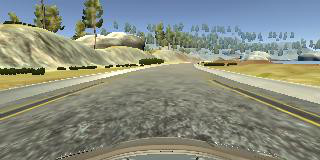
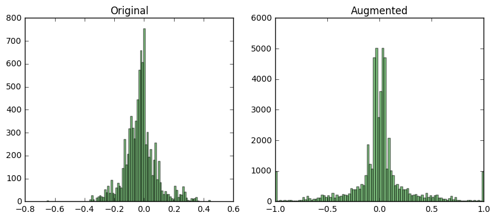
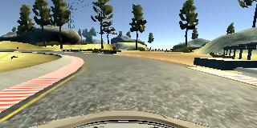
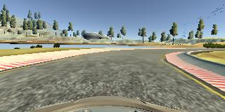

# Behavioral Cloning Project

------------
### *Abstract*

The goals of this project are the following:

 * Use the simulator to collect data of good driving behavior
 * Build, a convolution neural network in Keras that predicts steering angles from images
 * Train and validate the model with a training and validation set
 * Test that the model successfully drives around track one without leaving the road
 
A  successful drive through the test track was achieved by using [Nvidia neural network](https://devblogs.nvidia.com/parallelforall/deep-learning-self-driving-cars/). The neural network was used to processed the images and predict the steering angles, while a simple PI controller was used to maintain a constant speed. The resulting model allows the car to stay on the driveable part of the road, however, in some regions of the road the car shows an oscillatory behavior around the center line of the track. 

---

###1. Files Submitted 

The code is accessible via [link](http:/github.com/).

* model.py containing the script to create and train the model
* drive.py for driving the car in autonomous mode (PI and speed are updated)
* model.h5 contains a trained convolution neural network 
* report.md summarizing the results
* video.py  file used to generate video from images
* video.mp4 record of successful autonomous test drive
* report\_img  folder with images used in this report

###2. Execution of the submitted files
Using the Udacity provided simulator, the car can be driven autonomously around the track by executing in the root folder of the submission:

```python drive.py model.h5
```

The model can be retrained by executing

```mkdir -p result
training.py --offset 0.05 --gain 5.0 --epoch 10  model_nvidia ./data/
```

where `model_nvidia` is the name of the model and `./data/` the path to stored images

###3. Submited code

The model.py file contains the code for training and saving the convolution neural network. All necessary elements are documented inside.
Following entry points are important:

* The `main()` function contains the training pipeline.
* The `menu()` function contains processing of command line arguments.
* The `model_nvidia()` function contains the neural network definition.
* The static variable `augment_list`  contains the list of function used to augment the training data

The drive.py was modified for better PI parameters and speed. 

###Model Architecture and Training Strategy

####1. The model architecture
<div style="float: right; height:800px;">
<div style="text-align: center; vertical-align: middle; margins:0px; padding:0;"> Final architecture Nvidia <br/> with regularization 
</div>

</div>
The [Nvidia model](https://devblogs.nvidia.com/parallelforall/deep-learning-self-driving-cars/) is adopted for predicting the steering angles. This model was chosen as it was proven to work for such application. The only modifications to the architecture are done to prevent overfit and improve gradient flow.
 
The model is defined in function ```model_nvidia()```. It consists of three strided 5x5 convolution layers with increasing depth 24, 36, 48 accordingly, followed by two 3x3 convolution layers with depth 64 and finally steering angle is generated using four dense layers. The ReLu nonlinearity is used between each layer. 
 
To accommodate the asymmetry of the ReLu activation function around zero the model is initialized using [He et al.,](http://arxiv.org/abs/1502.01852) procedure instead of default Xavier.
 
 Two regularization techniques are used to prevent overfit: dropout layers and batch normalization. 
Several dropout layers are strategically placed in the network. 

A dropout layer is placed after first convolution layer to decrease dependency on specific parts of the image. A dropout layer is placed after extraction feature section  (last convolution layer ) to prevent dependency on a specific feature. The dropout layers are placed used in between dense layers to prevent overfitting statistical information about data. 

[Batch normalization layer](https://arxiv.org/abs/1502.03167) is placed after last 5x5 convolution layer of the network. It will increase the speed of learning by improving the gradient propagation and reducing dependency on the initialization. It also reduces chance of overfit.
 
Final architecture is depicted on the right.

 

####3. Creation of the Training Set

To capture good driving behavior, I first recorded three laps on track one using center lane driving. Here is an example image of center lane driving:



To improve generalization, I captured one lap of central driving in opposite direction on the track. 

The data set was augmented with images captured by the left and right cameras. Also mirrored images and steering angles with opposite sign were included into the training set. For example, here is the image above lipped:


It is done to avoid bias on turning left in the data set that is present due to circular nature of the training track. Below is the histogram of the steering angles in data set before and after augmentation:



Before augmentation, the data is clearly biased to the negative values.


The network was trained and tested with this data. This revealed that several sections of the track are not driven correctly, namely:

* First mud section



* The turn next to the lake after mud section



Additional passes through difficult sections were recorded and added to the data set. The network was re-trained. This has eliminated the problems in difficult sections.

####4. Training Process

The training pipeline consists of following elements:

Model is trained by minimizing the mean square error between predicted steering angle and recorded during the example drive. 

The Adam optimizer is used to control the learning process; therefore learning rate is inferred during the training automatically.

Data generator is used to supply the batches of images with corresponding steering angles. Data generator randomly shuffles data records with corresponding augmentation indexes and draws a batch of records. A batch of images is prepared by applying correct augmentations to images read from the hard drive using the data records.

The data set is split in proportion 80/20 for training and validation set.
The training data is augmented(as described above) to improve generalization. The validation set remains intact.

Specific callbacks are included in the training procedure to store the model with minimal validation loss and stop training if validation loss starts to grow. Thus if during training the model starts to overfit the data that can be detected using validation set and training is terminated.
The model was tested by running it through the simulator and ensuring that the vehicle could stay on the track.

###Notes & Conclusion

A  successful drive through the test track was achieved by using [Nvidia neural network](https://devblogs.nvidia.com/parallelforall/deep-learning-self-driving-cars/). The resulting model allows the car to stay on the driveable part of the road, however, in straigth sections of the road the car shows an oscillatory behavior around the center line of the track. 

The wide variety of parameters and changes to architecture were tried to eliminate the oscillatory behavior, including grid search of augmentation parameters, using LeNet like architecture, using an architecture with skip connections. Four conclusions can be drawn from experiments:

* If depth of the network exceeds five convolutional layers and has at least three dense layers, structure of the model has minor effects on quality of the drive
* The parameters of the adjustment of the steering angle for left and right camera images has major effect on driving quality
* An additional data augmentation are extremely difficult as there is no way to infer reasonable adjustments to steering angle (image shift, image rotation, perspective distortion were considered)
* Dependency on the speed during autonomous drive and latency in processing the images is not taken into account during learning and prediction process.

The most likely sources of the oscillatory behavior are dependencies between vehicle speed, processing speed(response latency), and parameters of the adjustment of the steering angle (the gain in proportional control for steering angle)

