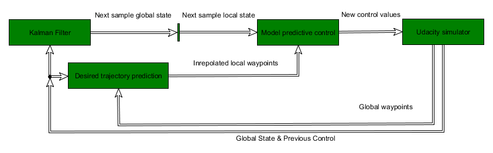
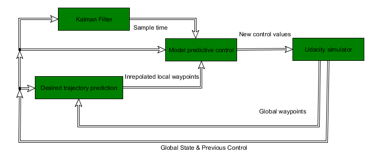

# CarND-Controls-MPC
*Self-Driving Car Engineer Nanodegree Program*

---

## Dependencies

* cmake >= 3.5
 * All OSes: [click here for installation instructions](https://cmake.org/install/)
* make >= 4.1
  * Linux: make is installed by default on most Linux distros
  * Mac: [install Xcode command line tools to get make](https://developer.apple.com/xcode/features/)
  * Windows: [Click here for installation instructions](http://gnuwin32.sourceforge.net/packages/make.htm)
* gcc/g++ >= 5.4
  * Linux: gcc / g++ is installed by default on most Linux distros
  * Mac: same deal as make - [install Xcode command line tools]((https://developer.apple.com/xcode/features/)
  * Windows: recommend using [MinGW](http://www.mingw.org/)
* [uWebSockets](https://github.com/uWebSockets/uWebSockets)
  * Run either `install-mac.sh` or `install-ubuntu.sh`.
  * If you install from source, checkout to commit `e94b6e1`, i.e.
    `
    git clone https://github.com/uWebSockets/uWebSockets 
    cd uWebSockets
    git checkout e94b6e1
    `
    Some function signatures have changed in v0.14.x. See [this PR](https://github.com/udacity/CarND-MPC-Project/pull/3) for more details.
* Fortran Compiler
  * Mac: `brew install gcc` (might not be required)
  * Linux: `sudo apt-get install gfortran`. Additionall you have also have to install gcc and g++, `sudo apt-get install gcc g++`. Look in [this Dockerfile](https://github.com/udacity/CarND-MPC-Quizzes/blob/master/Dockerfile) for more info.
* [Ipopt](https://projects.coin-or.org/Ipopt)
  * Mac: `brew install ipopt`
  * Linux
    * You will need a version of Ipopt 3.12.1 or higher. The version available through `apt-get` is 3.11.x. If you can get that version to work great but if not there's a script `install_ipopt.sh` that will install Ipopt. You just need to download the source from the Ipopt [releases page](https://www.coin-or.org/download/source/Ipopt/) or the [Github releases](https://github.com/coin-or/Ipopt/releases) page.
    * Then call `install_ipopt.sh` with the source directory as the first argument, ex: `bash install_ipopt.sh Ipopt-3.12.1`. 
  * Windows: TODO. If you can use the Linux subsystem and follow the Linux instructions.
* [CppAD](https://www.coin-or.org/CppAD/)
  * Mac: `brew install cppad`
  * Linux `sudo apt-get install cppad` or equivalent.
  * Windows: TODO. If you can use the Linux subsystem and follow the Linux instructions.
* [Eigen](http://eigen.tuxfamily.org/index.php?title=Main_Page). This is already part of the repo so you shouldn't have to worry about it.
* Simulator. You can download these from the [releases tab](https://github.com/udacity/self-driving-car-sim/releases).
* Not a dependency but read the [DATA.md](./DATA.md) for a description of the data sent back from the simulator.

## Basic Build Instructions

#### To build 
1. Clone this repo.
2. Make a build directory: `mkdir build && cd build`
3. Compile: `cmake .. && make`
4. Run to native MPC solution: `./mpc_native`  
Run to EKF + MPC solution: `./mpc_ekf`

---

# MPC project report

#### *Abstract*

The goals of this project are the following:

* Choose the model that can be used for control of the vehicle in Udacity simulator
* Build MPC controller
* Use waypoints provided by the simulator to calculate control input 
* Using MPC controller for steering and speed control of the vehicle in Udacity simulator
* Tune MPC controller parameters to achieve a save driving in the simulator

Two Model Predictive Control Systems for the car were implemented. One control system(MPC native) uses internal structure of MPC for solving time delay problem, the other one (EKF based) uses an external state estimator to contract time delays. Both control systems allow to the vehicle to safely complete laps at 60 - 75 (variance in max speed determined by speed and load of PC). 

### Control design

### Time

In this setup, there are two  time-related issues to be taken into account: 

+ Time delay
+ Control loop cycle time (sample time). 

In the figure below there is a schematic representation of two processes (simulator and controller) involved in the control of the vehicle on the track:

The upper line represents the simulator process timeline, the lower line represents the controller timeline. The vertical dashes on the time lines indicate time instances when data is communicated between processes. The arrows indicate the communicated messages between the two processes, measured telemetry by the simulator and the applied control by the MPC. Thicker segments on the lower line indicate the calculation time required for MPC. 

Following assumptions are taken for this project:

+ The simulator communicates the telemetry and applies the control input immediately upon receiving a control input message. Therefore the telemetry message represents a system state with the vehicle position and the velocity at the instance of communicating the message (t n), and a control input that will be applied (calculated from information sent at tn-1) until the next message is received. 
+ The computation time of the control loop is constant, i.e. the control loop has a fixed cycle time, therefore messages to simulator are sent with equal intervals.

Due to discrete nature of the control process and equal computation time the time delay will be constant and equal to sample time (one time step). Sample time is not known apriori. There is a number of ways it can be measured, in here it is identified as part of the state estimation.

### Vehicle model

Two coordinate frames are used during the calculation:  a global coordinate frame connected with the map and a local coordinate frame that is located and oriented the same way as the vehicle at the time instance when telemetry was sent by the simulator. 
Figure  below depicts relevant coordinate frames:

The bicycle kinematic model is used to model the vehicle motion. This model is discretized, equations below show how the state transition is calculated.

      x1 = x0 + v0 * cos(psi0) * dt
      y1 = y0 + v0 * sin(psi0) * dt
      psi1 = psi0 - v0 * delta0 / Lf * dt
      v1 = v0 + a0 * dt
where x0,y0, are position of the vehicle at time step n, psi0 is heading, v0 is speed in direction of the heading. a0 is acceleration, delta0 - steering angle.

For vehicle model the following simplification is employed:

+ The control input to the vehicle is a throttle. The throttle corresponds to the force that would result in acceleration. For simplicity of representation, these throttle values are used directly as acceleration(a0). 

### Interpolating the desired trajectory.
Telemetry values and waypoints are supplied in map coordinate frame (M in figure Coordinate frames). The global waypoints are recalculated to the local coordinate frame (n) and interpolated using a polynomial. This change of coordinate frames allows employing a simple polynomial fit algorithm. The parameters of the polynomial and the state of the vehicle (in a local coordinate frame)  are used by MPC solver to calculate the trajectory and desired control inputs.

### Architecture

There are two ways to address the one sample time delay issue: natively inside MPC or with external state estimation.
An internal MPC approach gives the benefit of simplicity, and external state estimation allows to use more powerful and thus more precise ways to do state estimation.

For description below:

+ Time step n  is the time instance when telemetry sent by the simulator
+ Time step n+1  is the time instance when new control input will be applied

#### EKF based solution

The architecture of the MPC EKF based solution is shown on the figure below:

In EKF based solution, Extended Kalman Filter is used to predict the complete state of the vehicle at sample time n+1(lines 323-334 in MPC.cpp). The code containing the EKF is ekf.cpp. 

An important property of this EKF that sample time is considered as part of the system state. It is constant but not directly observable. The telemetry is considered as low noise input, while the kinematic model of the vehicle is considered as approximate. This is done by setting process noise to high values, and measurement noise to small values. The parameters of the filter are tuned by fitting internally calculated NIS to chi-squared distribution. 

Since the state of the system is predicted to time step n+1 the MPC solver can use that system stat to predict the trajectory without a time delay. The control values(throttle and steering) for the time step n+1 will be in the first time step of the solver solution (lines 404,405 in MPC.cpp).

#### MPC native solution

The architecture of the MPC native solution is shown on the figure below:

In native MPC solution, MPC solver is forced to handle the time delay as part of predicted trajectory. The trajectory of movement is predicted starting from time step n. However, the control input that will be active during the computation time is already applied. Thus it is the fixed value that cannot be changed. Setting upper and lower bound of the control input for variables for one time step equal to that control value will force MPC solver to predict one step of the trajectory with a fixed input and optimize the remaining part. 

Since the first step in the trajectory predicted by MPC solver is used to predict system state after the time delay, the control values (throttle and steering) for the time step n+1 will be in the second time step of the solver solution (lines 412,413 in MPC.cpp). 

We will still use Extended Kalman Filter to detect sampling time; the MPC solver uses this sample time as part of the model.
 
### Model Predictive Control

The Model Predictive Control consists of the optimization solver(ipopt is used) and the function to be optimized. 
The function to be optimized consists of two parts: the constraints and the cost function. 

The constraints are used to define the motion model of the vehicle, i.e. how the state of the vehicle will change given a set of inputs. The model described above is used, but it is restructured as constraints. 

The cost function defines the target trajectory. A polynomial interpolation of the waypoints is an optimal path. The cross track error and the heading error are minimized thus the resulting trajectory will be as close as possible to an optimal path given the motion model constraints. Furthermore, the use of the actuator and the change in actuation from step to step is also penalized in the cost function. Thus a straight trajectory or a constant curve trajectory are preferred to wiggly one.

An essential element in the MPC is a prediction horizon. The prediction horizon is the period for which solver predicts the trajectory while optimizing the actuation values. The horizon is defined by the time step of the model and number of step the model is simulated. 
The prediction horizon should be as far away in future as possible since this allows to take more information into account. 

A good way to choose a simulation time step for MPC is set it equal to sample time, that would automatically align the simulated model and real control system minimizing the modeling errors.

Thus the number of steps to look ahead should be chosen as high as possible. However, the computation time is the main limitation. Nonlinear optimization problems scale with polynomial complexity, thus adding more simulated time steps will dramatically increase computation time. An experimentally determined value of 10 steps allows the vehicle to complete laps, without adding too much extra delay. Higher numbers e.g. 15 steps dramatically increase computation time, while a smaller number of time steps e.g. 5 requires reduction of the target speed.

### Results

Both control systems (EKF based and MPC native) allow to the vehicle to safely complete laps at 60 - 75 (variance in max speed determined by speed and load of PC). Moreover, the trajectories that are kept during the lap are almost identical. It is not possible to increase the speed using current motion model and uniform velocity set point. At speeds above 80 mph, the drift of the vehicle in the curve is bigger than the width of the road, and the controller cannot compensate for it anymore. Thus either the motion model should incorporate drift term or speed should be reduced based on the road curvature.

MPC native solution is easy to implement, but it requires and an additional way to measure the sample time.

EKF based solution is complex, but it allows to identify parameters of the model such time step simultaneously with state estimation. However, it requires additional tuning.