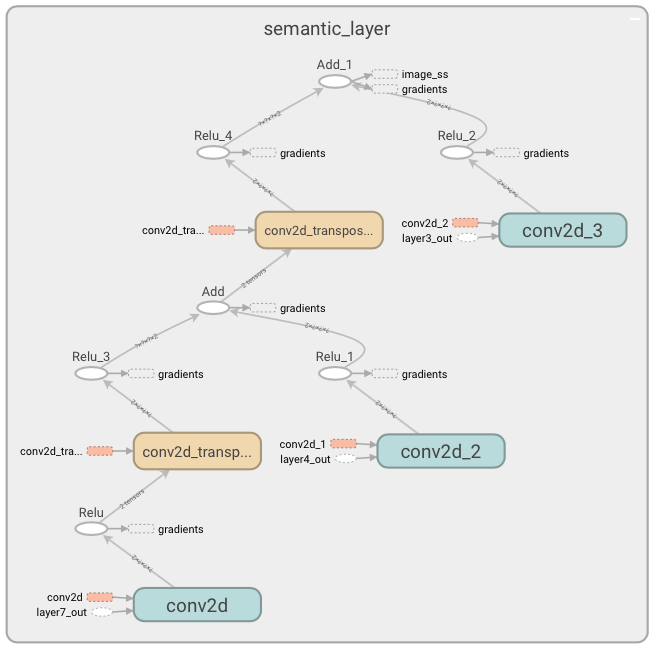
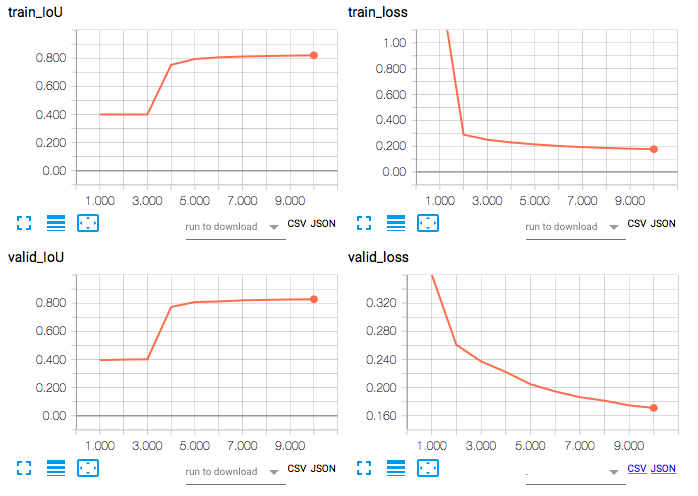
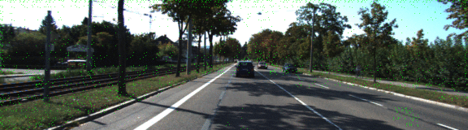

# Semantic Segmentation
### Introduction
In this project, you'll label the pixels of a road in images using a Fully Convolutional Network (FCN).

### Setup
##### Frameworks and Packages
Make sure you have the following is installed:
 - [Python 3](https://www.python.org/)
 - [TensorFlow](https://www.tensorflow.org/)
 - [NumPy](http://www.numpy.org/)
 - [SciPy](https://www.scipy.org/)
##### Dataset
Download the [Kitti Road dataset](http://www.cvlibs.net/datasets/kitti/eval_road.php) from [here](http://www.cvlibs.net/download.php?file=data_road.zip).  Extract the dataset in the `data` folder.  This will create the folder `data_road` with all the training a test images.

### Start
##### Implement
Implement the code in the `main.py` module indicated by the "TODO" comments.
The comments indicated with "OPTIONAL" tag are not required to complete.
##### Run
Run the following command to run the project:
```
python main.py
```
**Note** If running this in Jupyter Notebook system messages, such as those regarding test status, may appear in the terminal rather than the notebook.

### Submission
1. Ensure you've passed all the unit tests.
2. Ensure you pass all points on [the rubric](https://review.udacity.com/#!/rubrics/989/view).
3. Submit the following in a zip file.
 - `helper.py`
 - `main.py`
 - `project_tests.py`
 - Newest inference images from `runs` folder  (**all images from the most recent run**)
 
# Report

### *Abstract*
The goals of this project are the following:
+ Build a Fully Convolutional Network(FCN) for Semantic Segmentation as described in [J.Long at al](https://people.eecs.berkeley.edu/~jonlong/long_shelhamer_fcn.pdf)
+ Use pre-trained VGG net as base classification net
+ Build required deconvolution layers with skip connection
+ Train resulting FCN on Kitti Road dataset
+ Verify the results on the test images
The required FCN was built and trained. The validation Intersection over Union metric is 82%

## Network

VGG net was used as the base classification net. The outputs of VGG Layers 3, 4, 7 were used as inputs to semantic segmentation layer. The architecture of the semantic segmentation layer is shown in figure below


## Training

As the capacity of VGG net is high and Kitti Road dataset is quite small to avoid over fit, a transfer learning approach was employed. Only the semantic segmentation layer is trained using Kitti Road dataset, while VGG net weights are left intact as they were trained on a much larger ILSVRC dataset. 
Furthermore, Kitti Road dataset is augmented with following transformations

+ zoom & shift
+ zoom & rotate
+ vertical flip
+ horizontal flip

The network is trained for 10 epochs with 8 images in batch on a total of 2023 images, where 90% of images used for training and 10% for validation.

The trends in IoU and cross entropy loss per pixel  during training can be seen in the figure below


The result of the semantic segmentation after each epoch is captured on the animation below:


The final results of the semantic segmentation on the test set are in [folder](./runs/1509085431.2691891/images/)