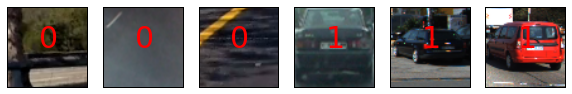
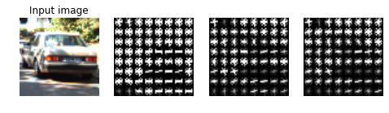
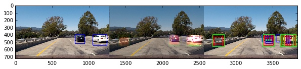
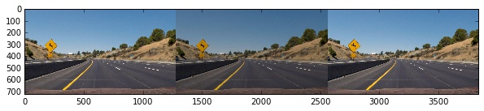
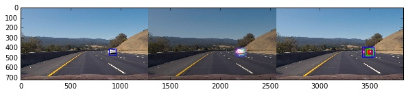
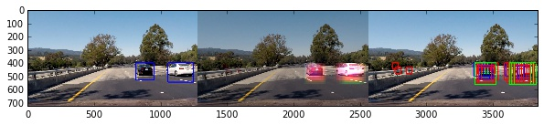
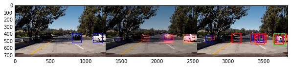
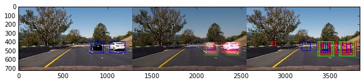

# Vehicle Detection Project

## *Abstract*

The goals/steps of this project are the following:

* Use Histogram of Oriented Gradients (HOG), a color-space features and color histograms to train a Linear SVM classifier using a provided labeled training set of images
* Feature vector should be normalized 
* Implement a sliding-window technique and use trained classifier to search for vehicles in the provided images.
* Run the pipeline on a video stream ( test\_video.mp4 and  project\_video.mp4) and create a heat map of recurring detections frame by frame to reject outliers and follow detected vehicles.
* Estimate a bounding box for detected vehicles.

The vehicle detection pipeline is implemented. The pipeline composed of sliding window approach to classifier pixels in the image as part of the car and blob detection to identify bounding box around the car. The classification is done using linear SVM applied to a composite feature vector which consists of Histogram of Oriented Gradients, color histogram, and color-space feature. The resulting algorithm allows maintaining a bounding box around the cars in project video with out any false positives but with small errors in the size of the bounding box.

## Files submitted
The code is accessible on [github link](https://github.com/YuryBrodskiy/carnd-yury.git)

* Car Detection.ipynb contains the code of the pipeline and related tests
* report.md summary the results
* output\_images processed sample images and images used in this report
* output\_videos processed sample videos
* convnet experimental code for uses of Neural network for heat map generation (Not part of the submission )

## Algorithm: Pipeline

### Architecture

The algorithm is an image processing pipeline. The following sequence of transformations are employed:

+ Image is masked to only limit vehicle search to relevant part of the image
+ Histogram of Oriented Gradients (HOG) are extracted from the masked area
+ The vehicles are searched in the image at five sizes to accommodate for perspective transformation by extracting part of the image and creating a feature vector
+ The resulting feature vector is classified using Linear SVM
+ The pixels of the image that were classified as a car are marked up  using a count of positive classification
+ The pixels with high positive classification count  are separated into individual blobs 
+ Individual blob is treated like a car, and a bounding box is constructed around it

### Training classifier
#### Prepare the data set
Frist two cells of the notebook used to prepare and verify the data. The loading and processing of the images is delayed using the generator pattern. The `get_data_list` return a list tuples of file name and class of image. The `augment_data_list` function is complete the tuple with processing steps such as feature extraction. This steps will be executed when the image is loaded thus saving memory.

##### Summary of the data set

+ Number of car  images  8792
+ Number of other images  8968
+ Dimensions of an image (64, 64, 3)
+ Data type of an image float32

*Examples from data set*

The red text in the middle indicate the class 0 - not a car, 1 - a car

#### Building feature vector
The 3rd cell contains support function for feature extraction:

+ color transformation
+ Histogram of Oriented Gradients (HOG) extraction
+ color histogram
+ scaled image

Below is a result of Histogram of Oriented Gradients features applied on the image in `YCrCb` color space using following parameters:

+ orientations 9
+ pixels\_per\_cell (8, 8) 
+ cells\_per\_block (2, 2)
*Note: These parameters were chosen to improve the result of the classification as described below.*

The 5th cell contains `extract_features` function. It defines the construction of the feature vector. The feature vector is designed as the concatenation of the HOG features of all `YCrCb` color channels, `YCrCb` individual channels histogram and downscaled image which can be interpreted as color-space features.

#### Training Linear SVM
The available data set is split into training and validation set with 80/20 ratio. The `extract_features` parameters are defined using the lambda function. The images are read from the disk and transformed into feature vectors using generator pattern. The scaling and centering of the data are determined by reducing the variance of the training set to a unit and removing the mean (`StandardScaler().fit` function). 
The training and validation set are then scaled and centered. The Linear SVM is trained using the training set.

After the classifier is trained, the quality of the prediction is estimated using validation set. The parameters of the `extract_features` (HOG transform parameters, spatial size, histogram bins) were adjusted to maximize the accuracy on the validation set.

##### Summary of the training results

+ Using: 
 + 9 orientations 
 + 8 pixels per cell
 + 2 cells per block
 + 32 px spacial size 
 + 32 histogram bins per channel
+ Total feature vector length: 8460
+ Test Accuracy of SVC =  0.999

### Sliding Window Search

The function `find_cars` encapsulate the sliding window search. The sliding window search constructed as follows:

+ convert image to correct color space and select only part of the image where car can be located - the road
+ resize the image 1/(search scale). It is done allow search cars of different sizes (far away and close by) using fixed size search window. Fix size search window is required simplify feature extraction
+ the step of the search window is determined using size of HOG cell and stride parameter
+ the HOG features a cached for speed
+ the image pixels and HOG inside the search window are used to construct feature vector
+ the feature vector is classified as car or not a car
+ the search window which classified is recorded as probable bounding box

### Multi-scale search - The heat map

As image recorded by the camera has the perspective effect, the far away objects appear smaller, there are different sizes of cars present on the image. The search for the cars is therefore performed on different scales. 

+ 0.7(car size 45x45 pixels) Near the horizon 
+ 1.0(car size 64x64 pixels)
+ 1.5(car size 96x96 pixels)
+ 2.0(car size 128x128 pixels)
+ 2.5(car size 160x160 pixels) Over the whole road 

Multi-scale search also allows removal of false positive classifications. The result of a single scale search is a list of bounding boxes that were classified as a car. These boxes are used to mark up pixels inside the box as belonging to a car. If a specific pixel was classified more times as belonging to a car, it is less likely to be a false positive. The process of counting the number of successful classification of a single pixel is referred as heat accumulation, while array that contains the counting bins is referred as the heat map. By combining multiple search scales on a single heat map results in a higher level of confidence. The low heat pixels are then treated as false positives and ignored. 
The pixels with high heat values are then segmented into individual blobs (`Label()` function), to identify all possible cars on the image. A blob of high heat pixels is used to define a bounding box around a single car. Disconnected blobs indicate the presence of more than one car in the image. 

The processing steps of the multi-scale search and heat accumulation are shown in the result section.

### Video Implementation -  The heat map

In a video, stream cars do not change location significantly from one frame to the other. This property can be used to future improve rejection of false positives. 
For a still image, the heat map is initialized with zero values; thus all car are detected only based on the classification results. For the video stream, the locations of the previously identified cars are stored as initial values of the heat map for next frame.

### Code
The processing of the images is encapsulated in the class `Pipeline`.

## Results
The pipeline is tested on provided images and videos. 
All test images are successfully processed. As can be seen below 3  processing steps are presented for each image.
From left to right:
+ The final image with a bounding box around the car
+ The original image with heat map overlay (color indicate different classification scales)
+ The original image with all positive classifications  (color indicate different classification scales)
 

All test videos are successfully processed. Each frame in the video shows the same processing steps as done for the still images. As can be seen on the [project\_video](./output_videos/project_video.mp4) and [test\_video](./output_videos/test_video.mp4)
The project video is marked up according to expectations: no false positives in final part of the image, there are always boxes roughly identify locations of the cars. 

## Conclusion & Discussion

The vehicle detection pipeline is implemented. The pipeline composed of sliding window approach to classifier pixels in the image as part of the car and blob detection to identify bounding box around the car. The classification is done using linear SVM applied to a composite feature vector which consists of Histogram of Oriented Gradients, color histogram, and color-space feature. The resulting algorithm allows maintaining a bounding box around the cars in project video without any false positives but with small errors in the size of the bounding box.

The major floor of this algorithm is the use of heat map and blob segmentation. This effectively makes it impossible the separate cars that overlay or next to each other. This effect can be seen on ~30-38 seconds of the project\_video. This problem is fundamental and therefore would require an entirely different approach for effective resolution, for example, application of the neural network such as [YOLO](https://pjreddie.com/darknet/yolo/).

An improvement in speed and quality of classification can also be archived by using the neural network as the classifier. The sliding window approach is effectively a convolution of the image with a "classification function" thus a convolution network can be build to directly generate the heat map. An example of implementation can seen in [my test notebook](./convnet/CarDetectionNN_conv.ipynb).
  

